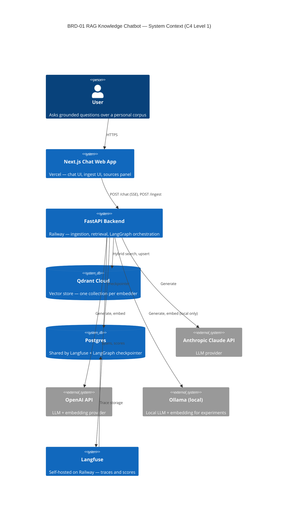
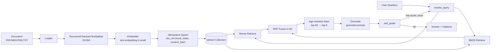
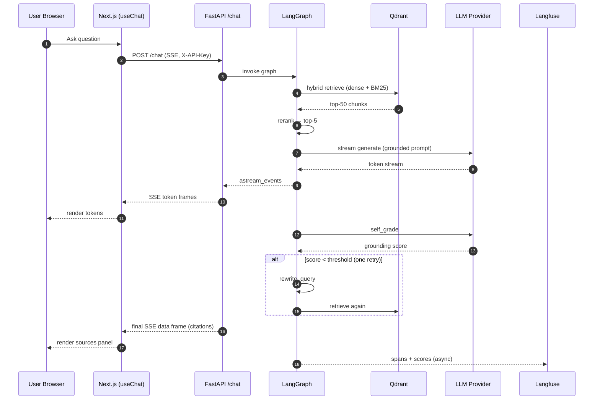

# BRD-01: RAG Knowledge Chatbot Platform

## Document Control

| Field | Value |
|---|---|
| Project Name | RAG Knowledge Chatbot |
| Document ID | BRD-01 |
| Document Version | 1.1 |
| Date | 2026-04-12 |
| Document Owner | Danny Pham |
| Prepared By | Danny Pham (with Claude Code) |
| Status | Draft |
| BRD Category | Platform |
| Source Material | `../../../plan.md` |

### Document Revision History

| Version | Date | Author | Changes |
|---|---|---|---|
| 1.0 | 2026-04-12 | Danny Pham | Initial draft derived from `plan.md` via doc-brd skill |
| 1.1 | 2026-04-12 | Danny Pham | CTO review polish: fix §8.2 Langfuse-on-Railway free-tier claim; downgrade R1 mitigation from weekly to monthly cost check; raise R6 likelihood Low → Medium and add key-rotation note; annotate §3.6 and §13.1 Postgres host as deferred to ADR; clarify Milestone 11 exit criterion as advisory-only |

---

## 1. Introduction

### 1.1 Purpose
Define the business needs, objectives, and scope for a production-shaped Retrieval-Augmented Generation (RAG) chatbot platform. The platform exists primarily as a learning vehicle for the modern RAG stack — hybrid retrieval, cross-encoder reranking, agentic orchestration, offline evaluation, and observability — while producing a real, deployable artifact usable against arbitrary document corpora.

### 1.2 Scope Statement
End-to-end ingestion → retrieval → grounded generation → streaming chat UI, deployed publicly via Railway (backend) and Vercel (frontend), with self-hosted Langfuse observability and a DeepEval offline test harness. Each architectural choice is motivated by a learning objective and captured in a downstream ADR.

### 1.3 Audience
- **Primary**: Document owner (Danny Pham) as solo developer and primary user.
- **Secondary**: Future self as long-term maintainer.
- **Tertiary**: Open-source collaborators discovering the project via GitHub.

### 1.4 Document Structure
This BRD follows the 18-section SDD Layer 1 structure. Sections 3.6 and 3.7 are populated in full because this is a Platform BRD that establishes the technology baseline subsequent BRDs (if any) and downstream artifacts (PRD/EARS/BDD/ADR) will inherit from.

---

## 2. Business Objectives

### 2.1 Strategic Goals

| ID | Objective |
|---|---|
| BRD.01.2301 | Master the modern production RAG stack end-to-end through hands-on implementation. |
| BRD.01.2302 | Ship a deployable RAG chatbot capable of grounded Q&A over a real document corpus. |
| BRD.01.2303 | Establish reusable patterns (provider abstraction, eval harness, ADR discipline) for future RAG/AI projects. |
| BRD.01.2304 | Build operational intuition for retrieval-quality trade-offs (hybrid vs dense, rerank vs none, agentic vs linear). |

### 2.2 Hypothesis
Hybrid retrieval (BM25 + dense + Reciprocal Rank Fusion) combined with cross-encoder reranking and a single LangGraph self-grading loop materially improves grounding quality and retrieval relevance over vanilla single-step dense RAG, and the improvement is measurable via DeepEval.

### 2.3 Success Metrics

| Metric | Target | Source |
|---|---|---|
| DeepEval Faithfulness | ≥ 0.85 | Blocking CI gate from Phase 7b onward |
| DeepEval Hallucination | ≤ 0.10 | Blocking CI gate from Phase 7b onward |
| NDCG@5 lift from rerank vs fusion-only | ≥ 10% | Reranker ablation in `test_rerank.py` |
| End-to-end p95 chat latency | < 3 s on Railway hobby tier | Manual instrumentation + Langfuse traces |
| Re-ingestion duplicate rate | 0% | Content-hash idempotency check |
| Monthly infra + API spend | < $50 | Vendor dashboards + alerts |

---

## 3. Project Scope

### 3.1 In Scope
- Ingestion of PDF, Markdown, HTML, and plain-text documents via CLI and web UI.
- Hybrid retrieval (BM25 + dense vectors + RRF fusion) over a Qdrant collection.
- Cross-encoder reranking to top-5.
- LangGraph orchestration: `rewrite_query → retrieve → rerank → generate → self_grade` with one rewrite loop on low grounding score.
- Pluggable LLM provider layer (Anthropic Claude, OpenAI, Ollama local).
- Pluggable embedding provider layer with one Qdrant collection per embedding model.
- Streaming chat endpoint with SSE and a Next.js 15 chat UI rendering source citations.
- Langfuse self-hosted observability covering every retrieval, rerank, and LLM call.
- DeepEval offline evaluation harness with baseline snapshots and a nightly CI run.
- Public deploy: Railway (FastAPI + Langfuse), Vercel (Next.js), Qdrant Cloud.
- ADR discipline: every dependency add or architectural change ships with an ADR.

### 3.2 Out of Scope
- Multi-tenant authentication, user accounts, role-based access.
- Non-English document corpora.
- LLM fine-tuning.
- Voice or video modalities.
- Semantic chunking as the default (kept as a Phase 7 ablation only).
- LangSmith (rejected in favor of self-hosted Langfuse — see ADR topic 3205).
- Mobile-native clients.

### 3.3 Workflows
1. **Document ingestion** — drop file → loader → chunker → embedder → idempotent Qdrant upsert.
2. **Conversational Q&A** — user question → query rewrite → hybrid retrieve → rerank → grounded generation → streamed response with citations.
3. **Trace inspection** — debug a session via Langfuse spans for retrieve / rerank / generate.
4. **Offline evaluation** — DeepEval suite over a curated dataset, comparing against baseline snapshots.

### 3.4 Boundaries
The system terminates at: (a) the user's browser, (b) third-party LLM and embedding APIs, (c) the Qdrant collection, (d) the Langfuse Postgres store, (e) the LangGraph checkpointer Postgres store. No other external systems are integrated in v1.

### 3.5 Assumptions
See Section 8.

### 3.6 Technology Stack Prerequisites (Platform BRD — populated in full)

| Layer | Technology | Notes |
|---|---|---|
| Vector store | **Qdrant** | Qdrant Cloud free tier in prod, Docker locally |
| LLM (chat) | **Anthropic Claude**, **OpenAI GPT**, **Ollama (local)** | Selected via `LLM_PROVIDER` env var |
| Embedding (primary) | **OpenAI `text-embedding-3-small`** | 1536 dimensions, **locked** |
| Embedding (local experiments) | **Ollama `nomic-embed-text`** | 768 dimensions, separate Qdrant collection |
| Sparse retrieval | **`rank-bm25`** | In-process over the same chunk set |
| Fusion | **Reciprocal Rank Fusion**, k = 60 | Dense + BM25 results merged |
| Reranker | **`BAAI/bge-reranker-base`** via `sentence-transformers` | Top-50 → top-5 |
| Chunker | **`RecursiveCharacterTextSplitter`** | size=512 tokens, overlap=64, separators `["\n\n", "\n", ". ", " "]` |
| Loaders | **LangChain `unstructured`** for PDF, native for MD/HTML/TXT | |
| Orchestration | **LangGraph** + `langgraph-checkpoint-postgres` | StateGraph with self-grading loop |
| LLM abstraction | Thin **`Provider` Protocol** over `langchain-anthropic` / `langchain-openai` / `langchain-ollama` | |
| Observability | **Langfuse self-hosted** | `CallbackHandler` wired into the graph |
| Offline eval | **DeepEval** | ContextualRecall, ContextualPrecision, NDCG@5, AnswerRelevancy, Faithfulness, Hallucination |
| Backend framework | **FastAPI** + `uvicorn[standard]` | `pydantic-settings` for config, `slowapi` for rate limits |
| Frontend framework | **Next.js 15** (App Router) + Tailwind + shadcn/ui | Vercel AI SDK `useChat` for streaming |
| Streaming protocol | **SSE** | One token per event; final `data:` frame carries citations |
| Backend host | **Railway** | API service + Langfuse service |
| Frontend host | **Vercel** | Auto-deploy on `main`, preview URLs on PRs |
| Vector DB host | **Qdrant Cloud** (free 1 GB cluster) | Not Railway-managed — keeps vector store portable |
| Relational DB | **Postgres** | Shared by Langfuse + LangGraph checkpointer (see noisy-neighbor risk in §10). Specific host (Railway add-on vs Neon free tier) deferred to the downstream "Shared Postgres" ADR. |
| Local data plane | **Docker Compose** | Qdrant + Postgres + Langfuse server + Langfuse worker |
| Package managers | **`uv`** (Python), **`pnpm`** (JS) | |
| CI | **GitHub Actions** | Lint, type-check, tests, nightly DeepEval |

### 3.7 Mandatory Technology Conditions (non-negotiable platform constraints)

| # | Condition | Rationale |
|---|---|---|
| MTC-01 | One Qdrant collection per embedding model — `EMBED_PROVIDER` switches collection, never mixes dimensions. | Mixing 1536-d and 768-d vectors in one collection is incoherent and silently corrupts retrieval. |
| MTC-02 | `doc_id + chunk_index` is the Qdrant point ID; `content_hash = sha256(raw_text)` drives idempotent upsert. Re-ingesting the same document MUST NOT create duplicate points. | Bootstrap and prod ingestion must be re-runnable safely. |
| MTC-03 | Hybrid search (dense + BM25 fused via RRF k=60) is the default and only retrieval path; rerank top-50 → top-5 with the cross-encoder. | Single-path dense retrieval is rejected as the platform default. |
| MTC-04 | The generator system prompt contains the verbatim grounding contract: *"Answer only from the provided context. Cite source chunks by `doc_id`. If the context is insufficient, reply `I don't have enough information to answer that` and stop. Do not use prior knowledge."* | Tested by DeepEval Faithfulness and Hallucination as **blocking CI gates**, not advisory. |
| MTC-05 | DeepEval Faithfulness and Hallucination metrics are **blocking** CI gates from Phase 7b onward. Retrieval precision regression > 5% (or > 2σ over the trailing 7 runs) opens an issue automatically. | Eval-as-tests is the safety net for retrieval changes. |
| MTC-06 | CORS uses an explicit Vercel-prod-and-preview origin allowlist. `*` is forbidden. | Public endpoints. |
| MTC-07 | `/chat` and `/ingest` require a static `X-API-Key` header validated by a FastAPI dependency. `/health` is public. | Cost protection on a public hobby deploy. |
| MTC-08 | `slowapi` rate limits: `/chat` 20/min/IP, `/ingest` 5/min/IP. | DoS + cost protection. |
| MTC-09 | `UploadFile` size cap 25 MB; MIME allowlist `application/pdf`, `text/markdown`, `text/html`, `text/plain`; per-file ingestion timeout 60 s; semaphore caps concurrent ingestion jobs at 2. | Ingestion DoS guards. |
| MTC-10 | Hard `max_tokens` output ceiling (1024) enforced in the provider layer. Prompt rejection if input context exceeds provider-specific budget. | Cost ceiling. |
| MTC-11 | `text-embedding-3-small` (1536-d) is the locked primary embedding model. Switching embedders requires a new ADR and a new collection. | Dimensional lock-in is structural, not a config knob. |

---

## 4. Stakeholders

| Role | Name | Responsibilities |
|---|---|---|
| Owner / Primary Decision Maker | Danny Pham | All architectural and product decisions; sole approver |
| Lead Developer | Danny Pham | All implementation work |
| Primary User | Danny Pham | Day-to-day chatbot use against personal corpora |
| Future Maintainer | Danny Pham (future self) | Long-term operation and enhancement |
| Secondary Users | Open-source collaborators | Discover and contribute via GitHub |

No external reviewers; this is a solo project. All approvals are self-approvals captured in §14.5.

---

## 5. User Stories

| ID | Story |
|---|---|
| BRD.01.0401 | As a learner, I want to ingest a corpus of PDFs and Markdown files and ask grounded questions about them, so I can see the full RAG loop end-to-end. |
| BRD.01.0402 | As a developer using the chatbot, I want token-by-token streamed answers with visible source citations, so I can verify grounding visually as the answer arrives. |
| BRD.01.0403 | As the system maintainer, I want every retrieve / rerank / LLM call traced in Langfuse with `env`, `user_id`, `session_id`, and `model` tags, so I can debug retrieval-quality regressions. |
| BRD.01.0404 | As the maintainer, I want a DeepEval suite that blocks merges on faithfulness or hallucination regressions, so retrieval changes are safe by default. |
| BRD.01.0405 | As a contributor, I want the LLM provider switchable via environment variable, so I can experiment with Anthropic, OpenAI, or local Ollama without code changes. |
| BRD.01.0406 | As an operator, I want the `/ingest` and `/chat` endpoints rate-limited and key-protected, so a public deploy cannot be abused into a budget incident. |

---

## 6. Functional Requirements

| ID | Requirement |
|---|---|
| BRD.01.0101 | Ingest PDF / Markdown / HTML / plain-text documents via CLI (`uv run ingest`) and via the web `/ingest` page. Output: chunked, embedded, idempotently upserted vectors in Qdrant. |
| BRD.01.0102 | Hybrid retrieval: run dense (Qdrant) and sparse (BM25) in parallel, fuse via RRF (k=60), then rerank top-50 to top-5 using `BAAI/bge-reranker-base`. |
| BRD.01.0103 | Streaming `/chat` endpoint (SSE): one token per event; a final `data:` frame carries citations (`doc_id`, snippet, score). |
| BRD.01.0104 | LangGraph state machine: `rewrite_query → retrieve → rerank → generate → self_grade`, looping back to `rewrite_query` once if grounding score < threshold. |
| BRD.01.0105 | Pluggable LLM provider (Anthropic / OpenAI / Ollama) and pluggable embedding provider (OpenAI / Ollama), each selected via env var. Embedder choice switches Qdrant collection. |
| BRD.01.0106 | Next.js 15 chat UI with Vercel AI SDK `useChat`, sources panel for the last answer, and a drag-drop ingestion page. |
| BRD.01.0107 | Langfuse spans for every retrieve, rerank, and LLM call, tagged with `env`, `user_id`, `session_id`, `model`. UI thumbs-up/down posts back as Langfuse scores. |
| BRD.01.0108 | DeepEval offline test suite covering retrieval (ContextualRecall, ContextualPrecision, NDCG@5), reranker ablation, and answer quality (AnswerRelevancy, Faithfulness, Hallucination). Baseline snapshots stored in `apps/api/evals/baselines/`. |
| BRD.01.0109 | LangGraph state checkpointed to Postgres via `langgraph-checkpoint-postgres`, sharing the Langfuse Postgres instance. |
| BRD.01.0110 | `/health` endpoint returns OK without auth and is the only unauthenticated route. |

---

## 7. Quality Attributes

### 7.1 Non-Functional Requirements

| Attribute | Target |
|---|---|
| **Performance** | p95 end-to-end chat latency < 3 s on Railway hobby tier. |
| **Security** | Static API key on `/chat` and `/ingest`; explicit CORS allowlist; per-IP rate limits; upload size + MIME + timeout + concurrency caps; provider-layer `max_tokens` ceiling. |
| **Grounding quality** | DeepEval Faithfulness ≥ 0.85, Hallucination ≤ 0.10 (blocking from Phase 7b). |
| **Idempotency** | Re-ingestion of an unchanged document creates zero new points (content-hash check). |
| **Portability** | The ingestion CLI runs identically against local Docker Qdrant or Qdrant Cloud — no snapshot dance. |
| **Observability** | 100% of retrieve / rerank / generate operations produce a Langfuse span. |
| **Cost** | Total monthly spend (infra + API) < $50 at MVP usage. |
| **Maintainability** | Strict mypy on `apps/api/src/`; ruff lint clean; `tsc --noEmit` clean on web. |

### 7.2 Architecture Decision Requirements (MANDATORY — 7 categories)

The 7 mandatory ADR topic categories below identify *what* needs an architectural decision and *why*. Specific ADR documents will be authored downstream (Phase 10 of the implementation plan); this BRD does not reference ADR numbers because no ADRs exist yet.

#### BRD.01.3201 — Infrastructure
- **Status**: Selected
- **Business Driver**: Public deploy of an FE + BE + observability stack on the smallest viable footprint to support a learning project with hobby-scale traffic.
- **Business Constraints**:
  - Total infra baseline < $30/month (excluding LLM API spend).
  - Single-developer operability — no Kubernetes overhead.
  - Backend autoscale must absorb evening usage spikes without manual scaling.
- **Alternatives Overview**:

  | Option | Function | Est. Monthly Cost | Selection Rationale |
  |---|---|---|---|
  | Railway hobby + Vercel hobby | Managed PaaS for API + web | ~$5–10 | **Selected** — lowest friction, Git-driven deploy, fits the budget |
  | Fly.io + Vercel | Edge-VM PaaS for API + web | ~$10–20 | Rejected — extra ops complexity; Fly's volume model adds friction |
  | AWS ECS Fargate + CloudFront | Container orchestration | ~$50–150 | Rejected — over-engineered for hobby traffic; cost overruns the constraint |
  | Self-hosted (single VPS) | DIY box | ~$5 | Rejected — TLS, deploy, backups, monitoring all become hand-rolled |

- **Cloud Provider Comparison**:

  | Criterion | GCP (Cloud Run) | Azure (Container Apps) | AWS (Fargate) |
  |---|---|---|---|
  | Service name | Cloud Run | Container Apps | Fargate |
  | Est. monthly cost | $20–40 | $25–45 | $50–80 |
  | Key strength | Auto-scaling to zero | AD integration | Largest ecosystem |
  | Key limitation | Cold starts | Higher baseline cost | Pricing complexity |
  | Fit for this project | Medium | Low | Low |

  **Note**: Hyperscalers were considered but Railway is selected over all of them on cost + ops simplicity grounds.

- **Recommended Selection**: Railway (API + Langfuse) + Vercel (web). Qdrant Cloud free tier hosts the vector store separately to keep it portable across compute providers.
- **PRD Requirements**: Specify autoscaling thresholds, cold-start measurement methodology, and Railway hobby-tier resource limits. Define the Vercel preview-deploy pattern.

#### BRD.01.3202 — Data Architecture
- **Status**: Selected
- **Business Driver**: Need a vector store, a relational store for orchestration checkpoints, and a relational store for observability traces — without paying for three separate database instances.
- **Business Constraints**:
  - Single Postgres instance shared by Langfuse and the LangGraph checkpointer.
  - Re-ingestion must be idempotent (content-hash dedupe).
  - Vector store must be portable across hosting providers.
- **Alternatives Overview**:

  | Option | Function | Est. Monthly Cost | Selection Rationale |
  |---|---|---|---|
  | Qdrant Cloud (free 1 GB) + shared Postgres | Vectors + relational | $0–5 | **Selected** — fits learning scale, hybrid-search-friendly |
  | pgvector on shared Postgres | Vectors inside Postgres | ~$5 | Rejected — weaker hybrid story; learning goal favors a dedicated vector DB |
  | Weaviate Cloud | Managed vector DB | ~$25+ | Rejected — cost; less idiomatic Python client |
  | Pinecone | Managed vector DB | ~$70+ | Rejected — cost; closed-source |

- **Cloud Provider Comparison**:

  | Criterion | GCP | Azure | AWS |
  |---|---|---|---|
  | Vector service | Vertex AI Vector Search | Azure AI Search | OpenSearch k-NN |
  | Est. monthly cost | $30+ | $30+ | $40+ |
  | Key strength | Managed scaling | Hybrid search built-in | Mature ecosystem |
  | Key limitation | Lock-in | Cost | Operational overhead |
  | Fit for this project | Low | Low | Low |

- **Recommended Selection**: Qdrant Cloud free tier for vectors. One Postgres instance (Railway add-on or Neon) shared by Langfuse and LangGraph checkpointer — see §10 R3 for the noisy-neighbor risk that this trade-off accepts.
- **PRD Requirements**: Backup cadence, dimension lock-in migration plan (what it costs to switch embedders), Postgres write-contention monitoring strategy.

#### BRD.01.3203 — Integration
- **Status**: Selected
- **Business Driver**: Multi-provider LLM access without vendor lock-in, plus offline experimentation via Ollama.
- **Business Constraints**:
  - Provider switch must be a single env var; no code change required.
  - Streaming, tool-call semantics, and token accounting must be normalized across providers.
  - Must work with both `langchain-*` provider adapters and a thin local Protocol layer.
- **Alternatives Overview**:

  | Option | Function | Est. Monthly Cost | Selection Rationale |
  |---|---|---|---|
  | Thin `Provider` Protocol over LangChain adapters | Multi-provider abstraction | $0 (lib) | **Selected** — minimal glue, swap-friendly |
  | Direct vendor SDKs only | Native clients | $0 (lib) | Rejected — duplicates streaming + tool-call code per provider |
  | LiteLLM proxy | OpenAI-shaped façade | $0 (self-hosted) | Rejected — extra hop, masks per-provider semantics that the project wants to learn |

- **Recommended Selection**: A `Provider` Protocol (`generate`, `stream`, `embed`) implemented for Anthropic, OpenAI, and Ollama using the corresponding `langchain-*` packages. The Protocol's leakage points (streaming chunk shapes, tool-call schemas, token counters) are documented as part of the multi-provider abstraction ADR (downstream).
- **PRD Requirements**: Define the streaming chunk normalization contract, the token-count interface, and how tool-call semantics differ across providers.

#### BRD.01.3204 — Security
- **Status**: Selected
- **Business Driver**: Public-internet endpoints on a hobby budget cannot be open to anonymous abuse — a single misuse can blow the LLM API budget for the month.
- **Business Constraints**:
  - Auth must be operable solo (no identity provider to manage).
  - Defense in depth: auth + rate limit + payload caps.
- **Alternatives Overview**:

  | Option | Function | Est. Monthly Cost | Selection Rationale |
  |---|---|---|---|
  | Static `X-API-Key` + slowapi + CORS allowlist + upload caps | Lightweight protection | $0 | **Selected** — appropriate for solo deploy |
  | OAuth (Auth0, Clerk) | Managed identity | $0–25 | Rejected — overkill; no multi-user requirement |
  | JWT issuance + refresh | Custom token flow | $0 | Rejected — adds code surface for no v1 benefit |
  | mTLS | Cert-based | $0 | Rejected — operationally hostile for solo use |

- **Recommended Selection**: Static API key validated by a FastAPI dependency on `/chat` and `/ingest`. CORS locked to exact Vercel prod + preview origins. `slowapi` rate limits per IP. Upload size 25 MB cap, MIME allowlist, 60 s ingestion timeout, 2-job concurrency semaphore. Provider-layer `max_tokens` ceiling.
- **PRD Requirements**: Key rotation policy, abuse-detection signals (rate-limit hit ratio, error-burst alerting), policy for raising rate limits after the first week.

#### BRD.01.3205 — Observability
- **Status**: Selected
- **Business Driver**: Debug retrieval / rerank / LLM behavior end-to-end; track quality regressions via traces and scores; learn the tracing layer for AI systems.
- **Business Constraints**:
  - Self-hosted (own the data, no per-trace billing surprises).
  - Single-binary deploy on Railway alongside the API.
  - Reuse the existing Postgres instance.
- **Alternatives Overview**:

  | Option | Function | Est. Monthly Cost | Selection Rationale |
  |---|---|---|---|
  | Langfuse self-hosted on Railway | LLM observability | $0 (compute share) | **Selected** — OSS, self-hosted, single-binary |
  | LangSmith hosted | LLM observability | $0–39 | Rejected — hosted-only, data residency, vendor lock-in |
  | OpenTelemetry + Tempo + Grafana DIY | General observability | $0 (self-host) | Rejected — too much glue for an AI-specific use case |
  | Phoenix (Arize) | LLM observability | $0 (OSS) | Rejected — Langfuse is the broader ecosystem fit |

- **Cloud Provider Comparison** (where to host Langfuse):

  | Criterion | Railway | Fly.io | Render |
  |---|---|---|---|
  | One-click template | Yes (official) | Manual | Manual |
  | Est. monthly cost | $0–5 | $5+ | $7+ |
  | Postgres reuse | Trivial | Possible | Possible |
  | Fit for this project | High | Medium | Medium |

- **Recommended Selection**: Langfuse self-hosted on Railway via the official template, sharing the same Postgres instance as the LangGraph checkpointer. `LANGFUSE_HOST` points at the Railway URL in prod and `localhost:3001` locally.
- **PRD Requirements**: Trace sampling strategy at scale, PII scrubbing rules, retention policy.

#### BRD.01.3206 — AI/ML
- **Status**: Selected
- **Business Driver**: The grounding/quality hypothesis (§2.2) requires hybrid retrieval, reranking, and a self-grading orchestration loop — and requires evaluating each component.
- **Business Constraints**:
  - Locked primary embedder: `text-embedding-3-small` (1536 d).
  - One Qdrant collection per embedder — never mix dimensions.
  - Reranker must justify its latency cost via NDCG@5 ablation (Phase 7b).
  - Grounding system prompt is binding; tested by DeepEval as a blocking gate.
- **Alternatives Overview**:

  | Option | Function | Est. Monthly Cost | Selection Rationale |
  |---|---|---|---|
  | Hybrid (BM25 + dense + RRF) + bge-reranker-base + LangGraph self-grading loop | Full pipeline | ~$5–15 (API) | **Selected** — matches the learning hypothesis |
  | Vanilla dense RAG | Single-step retrieval | ~$3–10 | Rejected — doesn't exercise the hypothesis |
  | Fully agentic (multi-tool, multi-step) | Tool-using agent | ~$15–30 | Rejected — scope creep for v1 |
  | Semantic chunking as default | Chunker variant | ~$5–15 | Rejected as default — runs as a Phase 7 ablation only |

- **Recommended Selection**: Hybrid retrieval + cross-encoder rerank + single-loop LangGraph self-grading. Embedding model locked to `text-embedding-3-small`. Reranker is on by default but gated by the ablation NDCG@5 ≥ 10% improvement requirement; if it fails the ablation, fall back to `bge-reranker-v2-m3`, add a query-level cache, or skip reranking for short queries.
- **PRD Requirements**: Reranker ablation methodology, grounding system-prompt regression test design, embedding migration playbook, semantic-chunking ablation protocol.

#### BRD.01.3207 — Technology Selection
- **Status**: Selected
- **Business Driver**: Production-shaped stack that mirrors what real RAG systems use, so the learning transfers to professional work.
- **Business Constraints**:
  - Backend in Python (LangGraph + DeepEval are Python-native).
  - Frontend in TypeScript/React (Vercel AI SDK is TS-native).
  - Monorepo via `pnpm` workspaces.
- **Alternatives Overview**:

  | Option | Function | Est. Monthly Cost | Selection Rationale |
  |---|---|---|---|
  | FastAPI + Next.js 15 (App Router) | Backend + frontend | $0 (lib) | **Selected** — idiomatic for the problem |
  | Flask + Next.js | Backend + frontend | $0 | Rejected — async story weaker than FastAPI |
  | NestJS + Next.js | Full-TS stack | $0 | Rejected — pushes Python ML libraries into a sidecar |
  | FastAPI + Remix | Backend + frontend | $0 | Rejected — Vercel AI SDK has best Next.js fit |

- **Recommended Selection**: FastAPI (with `uv`, `uvicorn`, `pydantic-settings`, `slowapi`) on the backend. Next.js 15 App Router (with Tailwind, shadcn, Vercel AI SDK `useChat`) on the frontend. `pnpm` workspaces for the monorepo.
- **PRD Requirements**: Monorepo boundary policy, shared type sync between zod (TS) and pydantic (Python), package version pinning policy.

---

## 8. Business Constraints and Assumptions

### 8.1 Constraints
- **Solo developer**, evening time budget — roughly one milestone per evening across 15 milestones.
- **Hard cost ceiling**: < $50/month for infra + API spend at MVP usage.
- **Hobby-tier hosting**: Railway and Vercel hobby plans only — no enterprise features.
- **Locked embedder**: `text-embedding-3-small` cannot change without an ADR + new collection + re-ingestion.
- **No external reviewers**: solo approval; no formal SLA.

### 8.2 Assumptions
- Free-tier headroom on Qdrant Cloud and Vercel is sufficient through MVP; Langfuse-on-Railway sits within the Railway hobby-tier compute budget, not free.
- LLM provider pricing remains stable enough that the < $50/month ceiling holds.
- Document corpora are English-language and within the supported MIME allowlist.
- Local Ollama model availability (`llama3.1:8b`, `nomic-embed-text`) for offline experimentation.

---

## 9. Acceptance Criteria

| ID | Criterion |
|---|---|
| BRD.01.0601 | `docker compose up -d` brings Qdrant (`localhost:6333`) and Langfuse (`localhost:3001`) online and reachable. |
| BRD.01.0602 | `cd apps/api && uv run ingest ../../data/sample.pdf` logs `N` chunks upserted; a second run logs zero new points (idempotency proven). |
| BRD.01.0603 | `uv run uvicorn src.main:app --reload` and `curl localhost:8000/health` returns `{"status":"ok"}`. |
| BRD.01.0604 | `cd apps/web && pnpm dev`, open `localhost:3000`, ask a question grounded in the ingested PDF, and the answer streams token by token. |
| BRD.01.0605 | The sources panel shows 3–5 chunks for the answer, each with a `doc_id` and snippet. |
| BRD.01.0606 | Opening Langfuse at `localhost:3001` shows a complete trace for the session: `rewrite_query → retrieve(k≈50) → rerank(k=5) → generate`. |
| BRD.01.0607 | `uv run deepeval test run apps/api/evals/` passes all metric thresholds defined in §2.3. |
| BRD.01.0608 | Production deploy to Railway (api + Langfuse) and Vercel (web) passes BRD.01.0604–0606 against the prod URLs. |
| BRD.01.0609 | Negative test: removing the reranker causes the nightly DeepEval run to flag a regression and open an issue automatically — proves the safety net works. |
| BRD.01.0610 | Spend alerts are configured manually on the Anthropic and OpenAI consoles on the day of first deploy (Phase 9 checklist item). |

---

## 10. Business Risk Management

| ID | Risk | Likelihood | Impact | Mitigation |
|---|---|---|---|---|
| R1 | LLM / embedding API spend overruns the $50/month ceiling | Medium | High | Hard `max_tokens` ceiling (MTC-10), per-IP rate limits (MTC-08), manual spend alerts on Anthropic + OpenAI consoles, monthly cost check against dashboards |
| R2 | Cross-encoder reranker pushes p95 latency above the 3 s budget on Railway hobby tier | Medium | Medium | Phase 6 ablation; fallback options: `bge-reranker-v2-m3`, query-level cache, or skip rerank for short queries |
| R3 | Shared Postgres noisy-neighbor contention between Langfuse and the LangGraph checkpointer | Low | Medium | Accept trade-off for cost; monitor write contention; split into two instances if observed (will be captured in the downstream "Shared Postgres" ADR) |
| R4 | Small DeepEval dataset (30–50 Q/A in Phase 7a) produces noisy regression signals | High | Medium | Phase 7b expansion to 100–200 Q/A pairs with mandatory out-of-scope cases; statistical floor (2σ over trailing 7 runs) before enabling the blocking CI gate |
| R5 | Greenfield learning curve causes timeline slippage | High | Low | Milestone-per-evening cadence is a target, not a deadline; no external commitments |
| R6 | Public deploy enables abuse (key leak, DoS) | Medium | High | API key in Railway secrets, never in repo; CORS allowlist; rate limits; upload caps; ingestion concurrency semaphore; rotate the static API key on any suspected leak |
| R7 | Embedding model deprecation forces a re-ingest + new collection | Low | Medium | Documented migration playbook (PRD requirement under topic 3206); idempotent ingestion makes re-runs cheap |

---

## 11. Implementation Approach

### 11.1 Phased Plan (15 Milestones)

The 15 milestones below come directly from `plan.md` §Phase 11. Each is sized at roughly one evening of work.

| # | Milestone | Exit Criteria |
|---|---|---|
| 1 | Repo scaffold + `docker compose up` brings Qdrant + Langfuse online | Both services reachable locally |
| 2 | FastAPI hello world + `/health` + Langfuse client initialized | `/health` returns OK; Langfuse connection logged |
| 3 | Ingestion pipeline (load → chunk → embed → upsert) via CLI only | Sample PDF produces N chunks in Qdrant |
| 4 | Dense retrieval endpoint `/search?q=…` returning top-k chunks | Manual queries return relevant chunks |
| 5 | Add BM25 + RRF fusion | Side-by-side comparison documented |
| 6 | Add cross-encoder reranker; measure p95 latency and NDCG@5 | Latency budget met OR fallback applied |
| 7 | LangGraph skeleton: `rewrite → retrieve → generate` (no loop yet) | Graph runs end-to-end |
| 8 | Streaming `/chat` endpoint with SSE | `curl --no-buffer` shows token stream |
| 9 | Next.js chat UI with `useChat` wired to `/chat` | Browser shows streamed answer + sources |
| 10 | Self-grading loop in LangGraph (grounding check → rewrite once) | Low-grounding answer triggers one retry |
| 11 | DeepEval dataset + first baseline run (Phase 7a — advisory only) | Baseline snapshot stored; CI runs the suite but reports only, does not block merges (gate enabled in Phase 7b) |
| 12 | File upload UI → `/ingest` | Drag-drop produces upserts |
| 13 | Deploy: Railway (api + Langfuse) + Vercel (web) | Prod URL passes §9 BRD.01.0608 |
| 14 | Write all 10 ADRs retroactively while reasoning is fresh | All ADRs in `docs/adr/` |
| 15 | Run `/simplify` and `/review-pr` passes | No actionable simplification findings |

### 11.2 Required Diagrams

Per the doc-brd Diagram Contract, this BRD must carry C4-L1, DFD-L0, and an async sequence diagram. All diagrams use Mermaid (no ASCII art).

```yaml
diagram_type: c4-l1
level: 1
scope_boundary: rag-knowledge-chatbot-platform
upstream_refs: []
downstream_refs: [PRD-pending]
```



```yaml
diagram_type: dfd-l0
level: 0
scope_boundary: rag-knowledge-chatbot-platform
upstream_refs: []
downstream_refs: [PRD-pending]
```



```yaml
diagram_type: sequence-async
level: 1
scope_boundary: chat-streaming-flow
upstream_refs: []
downstream_refs: [PRD-pending]
```



---

## 12. Support and Maintenance

| Aspect | Detail |
|---|---|
| Maintainer | Danny Pham (solo) |
| Issue tracking | GitHub Issues on the project repo |
| SLA | None (best-effort hobby project) |
| On-call | None |
| Rollback | Vercel preview deploys + Railway deployment history; redeploy a known-good commit |
| Incident response | Manual; Langfuse traces are the first port of call |
| Backups | Postgres backups via Railway add-on; Qdrant re-ingestion is the recovery story for vectors (cheap because of content-hash idempotency) |

---

## 13. Cost-Benefit Analysis

### 13.1 Costs (monthly estimate at MVP)

| Item | Cost |
|---|---|
| Railway hobby (API + Langfuse compute) | ~$5 |
| Vercel hobby (web) | $0 |
| Qdrant Cloud free tier | $0 |
| Postgres (Railway add-on or Neon free — host decision deferred to ADR) | $0–5 |
| OpenAI embeddings + chat | ~$5–15 |
| Anthropic Claude chat | ~$5–15 |
| Local Ollama | $0 |
| **Total target** | **< $30/month** (hard ceiling $50) |

### 13.2 Benefits
- Hands-on expertise across 10+ production RAG components.
- Portfolio artifact (deployed, observable, evaluated).
- Reusable patterns: Provider Protocol, eval harness, ADR template, Langfuse instrumentation.
- Stronger intuition for retrieval-quality trade-offs.

### 13.3 Intangibles
- Confidence to make architectural calls in production RAG work.
- A pre-vetted shortlist of which tools are worth using and which are not (captured in ADRs).

---

## 14. Project Governance

### 14.1 Decision Authority
Single owner — Danny Pham. All decisions self-approved. Decisions of architectural significance (anything matching the 7 ADR topic categories in §7.2) MUST be captured in an ADR before merging.

### 14.2 Change Control
Changes to this BRD bump the version in §Document Control and add a row to the Revision History table. Changes to the locked embedder (MTC-11) require a new ADR.

### 14.3 Communication
- Synchronous: none (solo).
- Asynchronous: GitHub Issues + commit messages.

### 14.4 Escalation
Not applicable.

### 14.5 Approval

| Approver | Role | Date | Signature |
|---|---|---|---|
| Danny Pham | Owner | 2026-04-12 | Approved (self) |

---

## 15. Quality Assurance

| Discipline | Tooling |
|---|---|
| Lint (Python) | `ruff` |
| Type-check (Python) | `mypy --strict` on `apps/api/src/` |
| Lint (TS) | `eslint` (Next.js default config) |
| Type-check (TS) | `tsc --noEmit` |
| Unit + integration tests (Python) | `pytest` + `pytest-asyncio` |
| Offline eval | `DeepEval` — advisory in Phase 7a, **blocking** in Phase 7b onward |
| Security review | `/security-check` skill before each deploy |
| Code review | `/review-pr` skill at each milestone |
| Simplification pass | `/simplify` skill after each feature PR |

Per doc-brd guidance, deeper QA standards (test coverage targets, defect SLAs) live in PRD §21 — this BRD only states the strategy.

---

## 16. Traceability

### 16.1 Upstream Sources
- `../../../plan.md` — implementation plan and source of all stack and milestone decisions. `upstream_mode: "none"` because plan.md is not a `docs/00_REF/` reference document; it is an implementation plan, and the doc-brd skill specifies keeping drift mode default in that case.

### 16.2 Downstream Artifacts
None yet. The downstream chain is:
- **PRD** (Layer 2) — to be authored via `doc-prd` skill in a future session.
- **EARS** (Layer 3) — to be authored via `doc-ears` skill.
- **BDD** (Layer 4) — to be authored via `doc-bdd` skill.
- **ADR** (Layer 5) — 10 ADRs planned (see plan.md §Phase 10), to be authored as decisions are made.

### 16.3 Requirements Matrix

| Objective | Functional Requirements | Acceptance Criteria | Risks |
|---|---|---|---|
| BRD.01.2301 (Master RAG stack) | 0101–0108 | 0601–0607 | R5 |
| BRD.01.2302 (Ship deployable artifact) | 0101, 0103, 0106, 0110 | 0604, 0608 | R1, R6 |
| BRD.01.2303 (Reusable patterns) | 0105, 0107, 0108 | 0606, 0607, 0609 | — |
| BRD.01.2304 (Quality intuition) | 0102, 0104, 0108 | 0607, 0609 | R2, R4 |

### 16.4 Health Score
Not applicable — no downstream coverage exists yet. Will become applicable once PRD-01 is authored.

---

## 17. Glossary

### 17.1 Terms
- **RAG** — Retrieval-Augmented Generation. Pattern where an LLM answers from retrieved context rather than parametric memory.
- **BM25** — Sparse keyword retrieval algorithm; the term-frequency baseline.
- **Dense retrieval** — Vector-similarity search over embedded text.
- **RRF** — Reciprocal Rank Fusion; combines multiple ranked lists by summing reciprocal ranks.
- **NDCG@k** — Normalized Discounted Cumulative Gain at rank k; ranking quality metric.
- **Cross-encoder** — Reranker that scores (query, document) pairs jointly; more accurate than bi-encoders, slower.
- **LangGraph** — State-machine framework for building multi-step LLM agents.
- **SSE** — Server-Sent Events; one-way streaming over HTTP.
- **Faithfulness** — DeepEval metric measuring whether the answer is supported by the retrieved context.
- **Hallucination** — DeepEval metric measuring fabricated content.
- **Chunking** — Splitting source documents into retrievable units.
- **Embedding** — Numerical vector representation of text.
- **Checkpointer** — Persistent storage of LangGraph state for resumability.
- **Idempotent upsert** — Insert-or-update that produces the same final state regardless of how many times it runs on identical input.
- **Grounding** — The property of an answer being supported by retrieved evidence.

### 17.2 Acronyms
BRD, PRD, EARS, BDD, ADR, SDD, MVP, RAG, BM25, RRF, NDCG, SSE, CORS, API, LLM, FE, BE, CI, CD.

### 17.3 Roles
- **Owner** — Sole decision authority and approver.
- **Maintainer** — Long-term operator (same person here).

### 17.4 System Components
See §3.6 for the canonical list.

### 17.5 References
- `../../../plan.md`
- `../../../.agents/skills/doc-brd/SKILL.md`

### 17.6 Change Log
- v1.0 (2026-04-12) — Initial draft.
- v1.1 (2026-04-12) — CTO review polish (see Document Revision History).

---

## 18. Appendices

### Appendix A — Source Material
Primary input: `../../../plan.md`. Every requirement, constraint, and milestone in this BRD is traceable to that document.

### Appendix B — doc-brd Skill Reference
Authored using `../../../.agents/skills/doc-brd/SKILL.md` (v1.2). Section structure, element ID format, and diagram contract were taken from that skill specification.

### Appendix C — Future Downstream Artifacts (Placeholders)
- `docs/02_PRD/PRD-01_rag_knowledge_chatbot/` — to be created via `doc-prd`.
- `docs/05_ADR/` — 10 ADRs planned (see plan.md §Phase 10).

### Appendix D — Validation Notes

**D.1 Automated validation script not run.** The doc-brd skill references `bash ai_dev_ssd_flow/01_BRD/scripts/validate_brd_wrapper.sh docs/01_BRD --skip-advisory`, but the upstream `ai_dev_ssd_flow/` tooling is not vendored in this project. The SKILL.md "Manual Checklist" was applied as the validation pass instead. If the upstream tooling is later vendored, run the wrapper script and reconcile any findings in v1.1.

**D.2 Monolithic structure exceeds the 25 KB guideline.** This file is ~42 KB. The doc-brd skill's nested-folder rule says monolithic structure is for documents ≤25 KB and section-based splitting (`BRD-01.0_index.md`, `BRD-01.1_*.md`, …) should be used above that threshold. Monolithic was chosen here for v1.0 because (a) the document is still small enough to read in one pass, (b) the project has no tooling that depends on per-section files, and (c) splitting now would obscure traceability before the first downstream artifact exists. Revisit at v1.1: if the BRD grows further or downstream PRD/EARS docs start linking into individual sections, split at that point.

**D.3 Manual Checklist Result (SKILL.md §Manual Checklist)**

| Check | Result |
|---|---|
| Document Control at top before all numbered sections | ✅ |
| All required metadata fields completed | ✅ |
| Document Revision History table initialized | ✅ |
| BRD type determined (Platform vs Feature) | ✅ Platform |
| Sections 3.6 & 3.7 handled correctly for BRD type | ✅ Both populated |
| Architecture Decision Requirements listed (no ADR numbers referenced) | ✅ All 7 categories, no ADR-NN refs |
| Strategy references in Traceability section | ✅ §16.1 points to plan.md |
| All 18 sections completed | ✅ |
| Traceability matrix created/updated | ✅ `BRD-00_TRACEABILITY_MATRIX.md` |
| No broken links | ✅ Relative links verified |
| File size <25KB monolithic threshold | ⚠️ ~42 KB — see D.2 |
| Mermaid diagrams for C4-L1, DFD-L0, sequence-async with intent headers | ✅ §11.2 |
| No `BRD-XXX` / `TBD` placeholders | ✅ Verified via grep |
| No specific `ADR-NN` references | ✅ Verified via grep |
| Element IDs use 3-segment `BRD.01.xxxx` format | ✅ |
